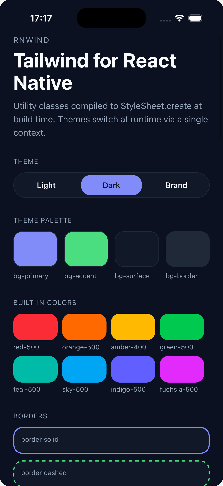
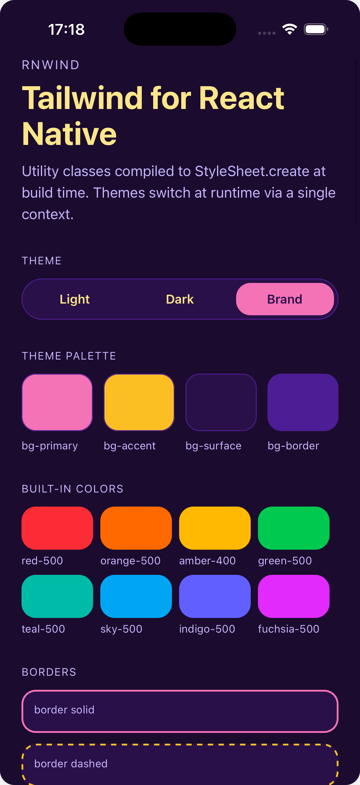
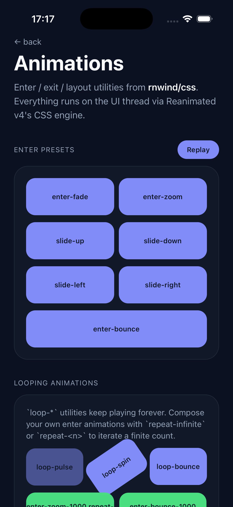
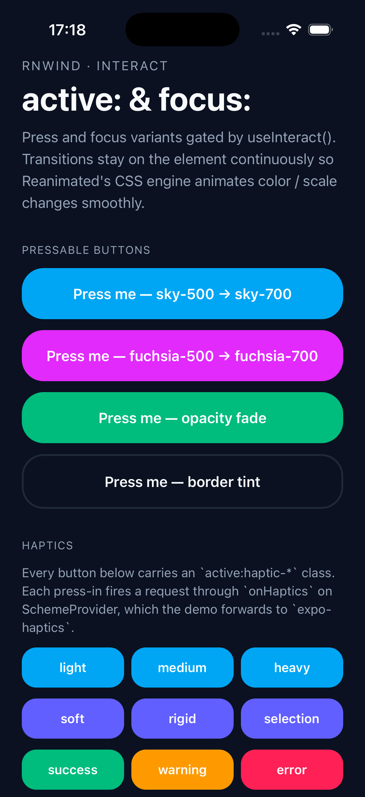

<div align="center">

<picture>
  <source media="(prefers-color-scheme: dark)" srcset="./assets/logo-dark.svg">
  
</picture>

**Tailwind CSS v4 for React Native — compiled at build time, zero runtime parsing.**

<p>
  <a href="https://github.com/sagltd/rnwind/actions/workflows/build.yml"></a>
  <a href="https://github.com/sagltd/rnwind/actions/workflows/code-check.yml"></a>
  <a href="./LICENSE"></a>
  
  
  
</p>

<p>
  <a href="#quickstart"><b>Quickstart</b></a> ·
  <a href="#run-the-demo"><b>Demo</b></a> ·
  <a href="./docs/"><b>Docs</b></a> ·
  <a href="./docs/architecture.md"><b>Architecture</b></a>
</p>

</div>

```tsx
<View className="flex-1 p-4 bg-bg md:flex-row md:gap-4">
  <Text className="text-lg text-fg font-semibold dark:text-white">Hello</Text>
</View>
```

A Metro babel transformer compiles every `className` at build time into a hoisted atom array (`['flex-1', 'p-4', 'bg-bg', …]`). At runtime, `lookupCss` walks the array once per hoist and caches the resolved style-object array in a `WeakMap` — same render → same array reference, so React Native's style diff short-circuits and no native-view update fires unless atoms actually changed.

> **No** runtime Tailwind parser. **No** regex on the hot path. **No** `var(--…)` left unresolved. Theme tokens, scheme variants, and breakpoint thresholds are all baked into the generated `*.style.js` files at build time.

<br />

## Showcase

<table>
<tr>
  <td align="center"></td>
  <td align="center"></td>
  <td align="center"></td>
  <td align="center"></td>
</tr>
<tr>
  <td align="center"><sub><b>Schemes</b><br/>palette + utilities</sub></td>
  <td align="center"><sub><b>Runtime switch</b><br/>light · dark · brand</sub></td>
  <td align="center"><sub><b>Animations</b><br/>enter / loop / repeat</sub></td>
  <td align="center"><sub><b>Interactive</b><br/>active: / focus: + haptics</sub></td>
</tr>
</table>

<sup>From the [`examples/expo-go`](./examples/expo-go) demo app — every screen is a real rnwind component.</sup>

<br />

## Features

- 🎨 **Real Tailwind v4** — `@tailwindcss/oxide`, every utility, every variant
- 🌓 **Any number of color schemes** — `@variant` blocks → typed `Scheme` union
- 📱 **Responsive design** — `sm:` `md:` `lg:` `xl:` `2xl:` + your own breakpoints
- ✨ **Reanimated v4 animations** — `enter-*` `exit-*` `loop-*` `repeat-*`
- 🛡️ **Safe-area utilities** — `*-safe` resolved at render against live insets
- ⚡ **Zero-parse runtime** — `WeakMap` cache, stable array refs, no JS-thread cost
- 🧪 **Real E2E tests** — `rnwind/testing` on `@testing-library/react-native`

<br />

## Quickstart

```bash
bun add rnwind tailwindcss
```

```js
// metro.config.js
const { getDefaultConfig } = require('expo/metro-config')
const { withRnwindConfig } = require('rnwind/metro')

module.exports = withRnwindConfig(getDefaultConfig(__dirname), {
  cssEntryFile: './global.css',
})
```

```css
/* global.css */
@import 'tailwindcss';
@import 'rnwind/css';

@custom-variant light (&:where(.scheme-light, .scheme-light *));
@custom-variant dark  (&:where(.scheme-dark, .scheme-dark *));

@theme {
  --color-bg: #f8fafc;
  --color-fg: #0f172a;
}
@layer theme {
  :root {
    @variant dark { --color-bg: #0b1120; --color-fg: #f8fafc; }
  }
}
```

```tsx
// app/_layout.tsx
import { RnwindProvider } from 'rnwind'
import { useColorScheme } from 'react-native'
import { useSafeAreaInsets } from 'react-native-safe-area-context'

export default function Root({ children }) {
  const system = useColorScheme()
  const insets = useSafeAreaInsets()
  return (
    <RnwindProvider scheme={system === 'dark' ? 'dark' : 'light'} insets={insets}>
      {children}
    </RnwindProvider>
  )
}
```

```tsx
// any component
<View className="flex-1 p-4 bg-bg md:flex-row">
  <Text className="text-fg dark:text-white">Hello</Text>
</View>
```

### Read context with `useRnwind`

```tsx
import { useRnwind } from 'rnwind'

function StatusBar() {
  const { scheme, activeBreakpoint, windowWidth, insets } = useRnwind()
  return (
    <Text className="text-xs text-muted">
      {scheme} · {activeBreakpoint} · {windowWidth}px · top inset {insets.top}
    </Text>
  )
}
```

`useRnwind()` is the single context read — destructure what you need (`scheme`, `activeBreakpoint`, `windowWidth`, `fontScale`, `insets`, `tables`, `onHaptics`). Every value is reactive.

That's it. Detailed setup & options: [`docs/setup.md`](./docs/setup.md).

<br />

## Run the demo

A fully-featured Expo example lives in [`examples/expo-go`](./examples/expo-go). It exercises every feature: schemes, responsive, animations, safe-area, interactive variants, haptics.

```bash
# from repo root
bun install
bun run build
cd examples/expo-go
bun install
bun run ios       # or: bun run android  /  bun run web
```

> First run takes ~30s while Tailwind oxide scans + the cache materialises. Subsequent saves Fast-Refresh in <100ms.

The example covers four screens:
- `app/index.tsx` — utilities, schemes, responsive, safe-area
- `app/animations.tsx` — `enter-*` / `loop-*` / `repeat-*`
- `app/interact.tsx` — `active:` / `focus:` + haptics
- `app/transitions.tsx` — `layout-*` shared transitions

Useful debug scripts:
```bash
bun run dump:index     # see what the transformer emits for app/index.tsx
bun run inspect        # build a dev bundle to .bundle-inspect/
bun run build:ios      # production export to .prod-bundle/
```

<br />

## Why rnwind

What it commits to:

- **Real Tailwind v4** — every utility, variant, and `@utility` from `@tailwindcss/oxide`. No DSL drift, no subset.
- **Build-time only.** Production bundles ship zero Tailwind code. The runtime is ~3KB of `WeakMap` lookups.
- **Reanimated v4 CSS animations out of the box.** `enter-*` / `exit-*` / `loop-*` / `repeat-*` compile straight to keyframes Reanimated runs on the UI thread.
- **Any number of color schemes** (`@variant brand`, `@variant high-contrast`, …), not just light/dark. Scheme names flow into TS as a literal union.
- **Mobile-first responsive** with full Tailwind defaults (`sm` / `md` / `lg` / `xl` / `2xl`) + `--breakpoint-*` overrides. Reactive via `useWindowDimensions().width`.
- **First-class testing.** `rnwind/testing` runs the real transformer + runtime in your test process, on `@testing-library/react-native`.

Other RN-Tailwind libraries have their own strengths — try them, pick what fits your app. rnwind's bet is on a strict build-time pipeline + a tiny stable runtime.

<br />

## Documentation

| | |
|---|---|
| **[`docs/responsive.md`](./docs/responsive.md)** | `sm:` / `md:` / `lg:`, custom breakpoints, `activeBreakpoint` |
| **[`docs/schemes.md`](./docs/schemes.md)** | `@variant` blocks, runtime switch, typed `Scheme` |
| **[`docs/animations.md`](./docs/animations.md)** | `enter-*`, `exit-*`, `loop-*`, `repeat-*`, custom `@keyframes` |
| **[`docs/safe-area.md`](./docs/safe-area.md)** | `*-safe`, `*-safe-or-N`, `h-screen-safe`, provider wiring |
| **[`docs/interact.md`](./docs/interact.md)** | `active:` / `focus:` variants, `chainPress`, haptics |
| **[`docs/api.md`](./docs/api.md)** | Full API reference — hooks, components, low-level |
| **[`docs/testing.md`](./docs/testing.md)** | `renderWithCss`, `renderHookWithCss`, Bun + Jest setup |
| **[`docs/setup.md`](./docs/setup.md)** | Metro options, monorepos, IntelliSense, `.d.ts` generation |
| **[`docs/architecture.md`](./docs/architecture.md)** | Full pipeline — parser, builder, runtime, transformer |

<br />

## Non-goals

- **No runtime Tailwind.** Your production bundle does not ship `@tailwindcss/oxide`, `lightningcss`, or `tailwindcss`.
- **No CSS cascade.** Every className resolves to a flat `{ property: value }` map at compile time; precedence is class-list order (last wins on RN flatten).
- **No `var()` at runtime.** Theme variables resolve during compile, per scheme.
- **No selector combinators.** `&:hover > *` doesn't map to RN. `active:` / `focus:` work via matching RN props; `sm:` / `md:` / etc. work via window-width gating.

<br />

## Development

```bash
bun install
bun run build        # rollup → packages/rnwind/lib
bun run test         # all packages
bun run code-check   # typecheck + lint + test (CI gate)
```

Bun-only. No npm, no tsx.

<br />

<div align="center">

**[Quickstart](#quickstart) · [Demo](#run-the-demo) · [Docs](./docs/) · [Architecture](./docs/architecture.md)**

[MIT](./LICENSE) · Built with ♥ and Bun

</div>
